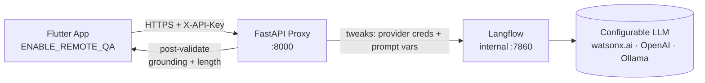

# VisionAssist Backend


---

## What this service is — and is not

**VisionAssist Backend** is the AI proxy that powers the *optional* remote
features of the [VisionAssist AI](../visionassist_ai/) Flutter app.

| | |
|---|---|
| ✅ **Is** | A FastAPI proxy that sits between the Flutter app and a self-hosted Langflow / LLM stack |
| ✅ **Is** | The only place that holds LLM credentials — no API key is ever bundled in the mobile app |
| ✅ **Is** | A safety layer that deterministically validates LLM output before returning it |
| ❌ **Is not** | Required for the Flutter app to work — the app is offline-first; all 4 modes function with zero network calls by default |
| ❌ **Is not** | A general-purpose LLM gateway — it proxies exactly two operations |
| ❌ **Is not** | A replacement for the Flutter app's local extractors — it rephrases/enhances, never owns structured data |

---

## Architecture



The Flutter app only ever contacts `api` (port 8000).  
`langflow` is not published to the host network by default — it lives on the
internal Docker bridge and is reachable only by `api`.

---

## API contract

Base path: `/v1`  
All endpoints (except `/v1/health`) require header `X-API-Key: <PROXY_API_KEY>`.

| Endpoint | Method | Request body | Response | Error codes |
|---|---|---|---|---|
| `/v1/health` | GET | — | `{status, langflow}` | — |
| `/v1/qa/answer` | POST | `{question, ocr_text}` | `{answer, is_grounded, source_sentence}` | 401, 422, 429, 503 |
| `/v1/ingredients/summarize` | POST | `{ocr_text, allergens, negated_allergens, expiry_date, prices}` | `{summary}` | 401, 422, 429 |

### `POST /v1/qa/answer`

```json
// Request
{ "question": "Berapa kali minum obat ini sehari?",
  "ocr_text": "Paracetamol 500mg. Diminum 3 kali sehari setelah makan." }

// Response — grounded
{ "answer": "Diminum 3 kali sehari setelah makan.",
  "is_grounded": true,
  "source_sentence": "Diminum 3 kali sehari setelah makan." }

// Response — ungrounded / medicine fallback
{ "answer": "Saya tidak yakin, silakan tanyakan apoteker.",
  "is_grounded": false,
  "source_sentence": null }
```

Fields map directly to Flutter's `QaAnswer` domain entity
(`answer → answer`, `is_grounded → isGrounded`, `source_sentence → sourceSentence`).

### `POST /v1/ingredients/summarize`

```json
// Request
{ "ocr_text": "...",
  "allergens": ["Kacang"],
  "negated_allergens": ["Gluten"],
  "expiry_date": "12/2026",
  "prices": ["Rp 15.000"] }

// Response
{ "summary": "Mengandung kacang, bebas gluten, kedaluwarsa Des 2026." }
```

The Flutter app **owns** `allergens`, `negated_allergens`, `expiry_date`, and
`prices` — it only replaces its locally-composed `summary` field with this
response.  The backend never becomes the source of truth for structured fields.

### Error responses

| Code | Meaning |
|---|---|
| `401` | Missing or invalid `X-API-Key` |
| `422` | Validation error (missing field, length exceeded) |
| `429` | Rate limit exceeded (default: 60 req/min per API key) |
| `503` | Langflow unreachable or timed out (Q&A only; ingredient endpoint falls back gracefully) |

---

## Safety / grounding

Two independent safety layers guard every response:

1. **Prompt-level** — the Langflow flow's prompt template instructs the LLM to
   answer only from the provided context and return `NOT_FOUND` when the
   answer is absent.
2. **Code-level (deterministic)** — FastAPI runs the grounding guard *after*
   every Langflow call, before the response leaves the proxy:
   - Jaccard token overlap between the LLM answer and `ocr_text` must be ≥
     `GROUNDING_MIN_OVERLAP` (default 0.3).
   - Any dosage/quantity number (e.g. "3 tablet", "500mg") must appear
     verbatim in `ocr_text` — hallucinated numbers always trigger the safe
     fallback regardless of overlap score.
   - Ingredient summaries must not introduce allergen keywords absent from the
     input `allergens`/`negated_allergens` lists.
   - Summaries must be ≤ 15 words.

The safe-fallback phrase (`"Saya tidak yakin, silakan tanyakan apoteker."`) is
the same phrase used by the Flutter app's local `LocalQaRepository` — the
remote path is a transparent upgrade, not a behaviour change.

---

## Running locally

### Prerequisites

- Docker ≥ 24 and Docker Compose v2
- A `.env` file (copy from `.env.example`)

### 1. Configure

```bash
cd visionassist_backend
cp .env.example .env
# Edit .env — at minimum set:
#   PROXY_API_KEY, MODEL_PROVIDER, and the credentials for your chosen provider,
#   and the two LANGFLOW_FLOW_ID_* values (see step 3).
```

### 2. Start the stack

```bash
docker compose up --build
```

The API will be available at `http://localhost:8000`.  
Interactive docs: `http://localhost:8000/docs`

### 3. Import flows and copy Flow IDs

On first start, Langflow auto-loads the flows from `flows/` via the mounted
volume.  After the stack is healthy:

1. Uncomment the `ports` section under `langflow` in `docker-compose.yml`:
   ```yaml
   # ports:
   #   - "7860:7860"
   ```
2. `docker compose up langflow` — open `http://localhost:7860`.
3. Find the **Visual QA** and **Ingredient Summary** flows.  Copy each flow's
   UUID from the URL bar (e.g. `http://localhost:7860/flow/xxxxxxxx-...`).
4. Paste those UUIDs into `.env`:
   ```
   LANGFLOW_FLOW_ID_QA=xxxxxxxx-...
   LANGFLOW_FLOW_ID_INGREDIENT=yyyyyyyy-...
   ```
5. Re-comment the `ports` line and `docker compose restart api`.

See `flows/README.md` for the full edit → export → commit workflow.

### 4. Test the health endpoint

```bash
curl http://localhost:8000/v1/health
# {"status":"ok","langflow":"reachable"}
```

### 5. Test a Q&A call

```bash
curl -X POST http://localhost:8000/v1/qa/answer \
  -H "X-API-Key: your-proxy-api-key" \
  -H "Content-Type: application/json" \
  -d '{"question":"Berapa kali minum?","ocr_text":"Diminum 3 kali sehari setelah makan."}'
```

---

## Pointing the Flutter app at this backend

In `visionassist_ai/.env` (or the Flutter app's environment config):

```
ENABLE_REMOTE_QA=true
API_PROXY_URL=http://<your-server-ip>:8000
```

> The Flutter app's `app_config.dart` reads `API_PROXY_URL` and
> `ENABLE_REMOTE_QA`.  When `ENABLE_REMOTE_QA` is `false` (default), the app
> uses only on-device AI — this backend can be entirely absent.

---

## Running tests

```bash
cd visionassist_backend
pip install -r requirements.txt

# Set the required env vars (no live Langflow needed — all calls are mocked).
export PROXY_API_KEY=test-key
export LANGFLOW_FLOW_ID_QA=aaaaaaaa-0000-0000-0000-000000000001
export LANGFLOW_FLOW_ID_INGREDIENT=bbbbbbbb-0000-0000-0000-000000000002

pytest tests/ -v --cov=app --cov-report=term-missing
```

To run lint and type-check:

```bash
ruff check .
mypy app/ --ignore-missing-imports --strict
```

---

## Security notes

- **No key in the app** — `PROXY_API_KEY` and all LLM credentials live only
  in this backend's environment.  The Flutter app sends only its own
  `PROXY_API_KEY` in the `X-API-Key` header.
- **Shared-secret auth** — appropriate for a bootcamp/demo deployment with a
  single trusted client.  For production: issue per-device keys stored in a
  database, or migrate to OAuth 2.0 / JWT (see `app/deps.py` for the upgrade
  path).
- **No raw content in logs** — structured logs record method, path, status,
  latency, and guard-rejection reason codes only.  `question`, `ocr_text`, and
  LLM output text are never written to logs.
- **Rate limiting** — in-memory sliding-window limiter (default 60 req/min per
  API key).  For multi-worker or multi-instance deployments, swap the storage
  backend to Redis (see `app/deps.py` for notes).
- **CORS** — locked to no origins by default.  The Flutter mobile app does not
  require CORS.  To add a web origin, edit `allow_origins` in `app/main.py`.

---

## Repository layout

```
visionassist_backend/
├── .github/workflows/ci.yml     # lint · type-check · pytest (no live LLM)
├── app/
│   ├── main.py                  # FastAPI app, routers, exception handlers
│   ├── config.py                # pydantic Settings from env
│   ├── deps.py                  # API-key auth + in-memory rate limiter
│   ├── langflow_client.py       # async HTTP client + tweaks builder
│   ├── guards/
│   │   ├── grounding.py         # overlap · medicine-trigger · dosage guard
│   │   └── ingredient_guard.py  # allergen-leak · word-count guard
│   ├── routers/
│   │   ├── health.py            # GET  /v1/health
│   │   ├── qa.py                # POST /v1/qa/answer
│   │   └── ingredients.py       # POST /v1/ingredients/summarize
│   └── schemas/
│       ├── qa.py                # QaAnswerRequest · QaAnswerResponse
│       └── ingredients.py       # IngredientSummarizeRequest · Response
├── flows/
│   ├── visual_qa.json           # Langflow flow — Visual Q&A
│   ├── ingredient_summary.json  # Langflow flow — Ingredient Summarizer
│   └── README.md                # Node-graph prose + import/export guide
├── tests/
│   ├── test_grounding_guard.py
│   ├── test_ingredient_guard.py
│   ├── test_qa_router.py
│   └── test_ingredients_router.py
├── Dockerfile                   # multi-stage, non-root, HEALTHCHECK
├── docker-compose.yml           # langflow + api, internal network
├── requirements.txt
├── .env.example
└── README.md
```

---

## License

MIT © 2024 VisionAssist Contributors — see [LICENSE](LICENSE).
